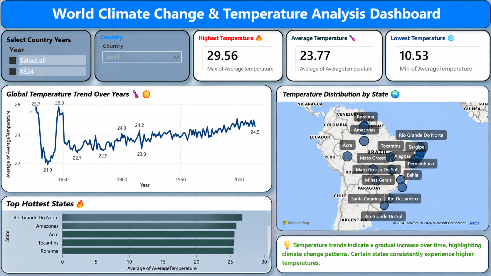
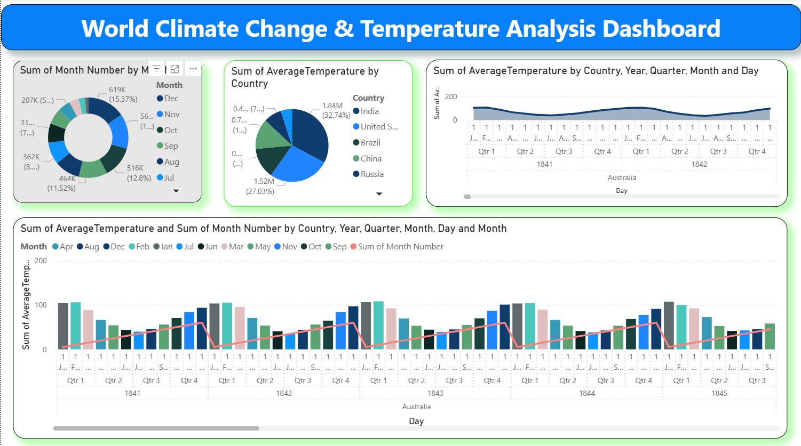

# 🌍 World Climate Change Temperature Analysis Dashboard

## 📊 Project Overview

The **World Climate Change Temperature Analysis Dashboard** is an interactive data visualization project developed using **Microsoft Power BI**.

The project focuses on analyzing historical climate and temperature data to identify trends, patterns, regional variations, and meaningful insights through interactive dashboards.

## 🖼️ Dashboard Preview

### 🌡️ Brazil Climate Dashboard

### 📈 Detailed Analysis

---

## 🎯 Objectives

- Analyze historical temperature trends
- Identify changes in temperature over time
- Compare climate patterns across regions
- Visualize climate data interactively
- Identify important trends and patterns
- Present complex climate data through clear visualizations

---

## 📂 Dataset

The dataset contains historical climate and temperature records used to analyze changes and patterns across different time periods and geographical regions.

The dataset includes relevant information such as:

- Date / Year
- Country / Region
- Temperature measurements
- Climate-related indicators
- Geographic information
- Historical observations

---

## ⚙️ Workflow

1. **Data Collection** – Imported the climate dataset into Power BI
2. **Data Cleaning** – Handled missing values and inconsistencies
3. **Data Transformation** – Prepared and transformed data using Power Query
4. **Exploratory Data Analysis** – Identified trends and patterns
5. **Data Modeling** – Organized data and created relationships
6. **Dashboard Development** – Built an interactive Power BI dashboard
7. **Visualization** – Created charts, KPIs, maps, and interactive filters
8. **Insight Generation** – Derived meaningful insights from the data

---

## 📈 Dashboard Features

- Interactive climate visualizations
- Temperature trend analysis
- Regional comparisons
- KPI indicators
- Interactive slicers and filters
- Time-based analysis
- Geographic analysis
- Comparative charts
- Data-driven insights

---

## 🔍 Key Insights

- Identifies long-term temperature trends
- Highlights temperature variations across regions
- Shows changes in climate patterns over time
- Helps compare geographical temperature differences
- Reveals significant historical temperature patterns
- Provides an interactive way to explore climate data

---

## 🛠️ Tools & Technologies

- Microsoft Power BI
- Power Query
- DAX
- Data Analysis
- Data Visualization
- Data Modeling

---

## 🚀 How to Run the Project

1. Clone the repository.
2. Open the project folder.
3. Open the `.pbix` file using **Microsoft Power BI Desktop**.
4. Refresh the data if required.
5. Explore the interactive dashboard using the available filters, slicers, and visualizations.

---

## 🔮 Future Improvements

- Add predictive analytics for temperature forecasting
- Integrate additional climate datasets
- Add real-time or regularly updated data
- Implement advanced DAX calculations
- Add machine learning-based predictions
- Enhance dashboard interactivity
- Deploy the dashboard as a web-based analytics solution

---

## 🤝 Contributing

Contributions and suggestions are welcome. Feel free to fork the repository and submit a pull request.

---

## 👨‍💻 Author

**Anukula Shalman Raju**

Data Science Student

**Areas of Interest:**
- Data Analysis
- Data Visualization
- Machine Learning
- Python
- Power BI
- SQL

---

## 📬 Contact

- **GitHub:** https://github.com/Shalman007
- **LinkedIn:**https://www.linkedin.com/in/shalmanraju/ 
- **Email:** shalmanraju37@gmail.com

---

⭐ If you found this project useful, don't forget to give it a star!
